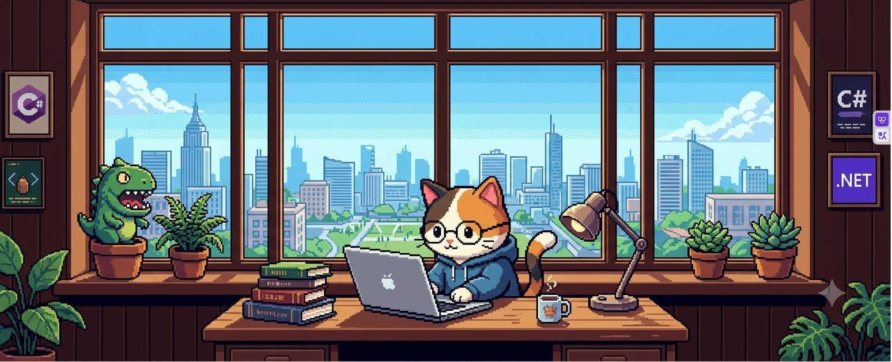

<!-- Banner Pixel của bạn -->

 

<table>
<tr>
<td width="48%" valign="top">

 

<!-- Tên phong cách Serif mềm mại -->

  <b>Software Engineer</b> • Vietnam 🇻🇳 
  Crafting resilient backends & modern web experiences.

  🌱 <b>Focus:</b> .NET, React, Cloud & AI 
  ☕ <b>Vibe:</b> Pixel art, coffee & clean architecture

  
  
  

</td>
<td width="52%" valign="top">

### 🎒 Inventory & Toolkit

  <!-- Core & Backend -->
   
  <!-- Web & Data -->
   
  <!-- Tools & Environment -->
  

</td>
</tr>
</table>

---

### 🎮 Featured Works

* **[DOTUS Store](https://github.com/tudo2212485)** — Minimalist streetwear storefront built with Next.js 14, Tailwind, and Supabase.
* **[QLNH WebApp](https://github.com/tudo2212485/DACN_QLNH)** — End-to-end restaurant management platform using React & ASP.NET Core.
* **[PizzaJ](https://github.com/tudo2212485/DA_Pizzaez)** — Desktop pizza ordering application in C# / WPF designed with SOLID principles.

 

  

